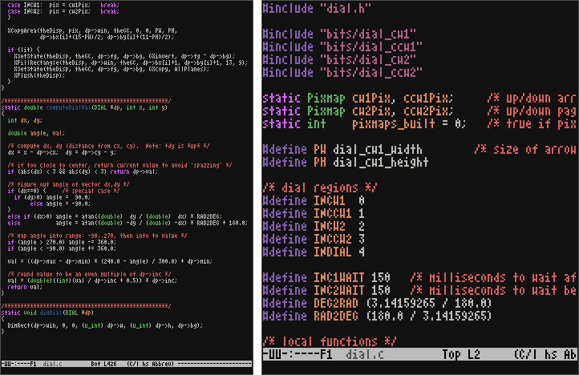

# Atari800 Font

## Overview

Atari800 is a very small 4x8 pixel monospaced bitmap font originally designed for an Atari 800 terminal emulator.

The original font has been converted to ISO 10646-1/Unicode and expanded to include full coverage of the Box Drawing and Block Elements Unicode blocks.  Partial coverage of the Geometric Shapes Unicode block is also included.

## Installation

1. If you would prefer a PCF format font, run `make`.
2. Copy or symlink the font to your ~/.fonts directory:
   `cp atari800-normal.bdf ~/.fonts`
3. Run `fc-cache -fv` to update your font cache.

## Credits

Atari800 is based on the work of Thomas A. Fine.  Thomas' original font can be found at [Tom's X11 Fonts](http://hea-www.harvard.edu/~fine/Tech/x11fonts.html).
